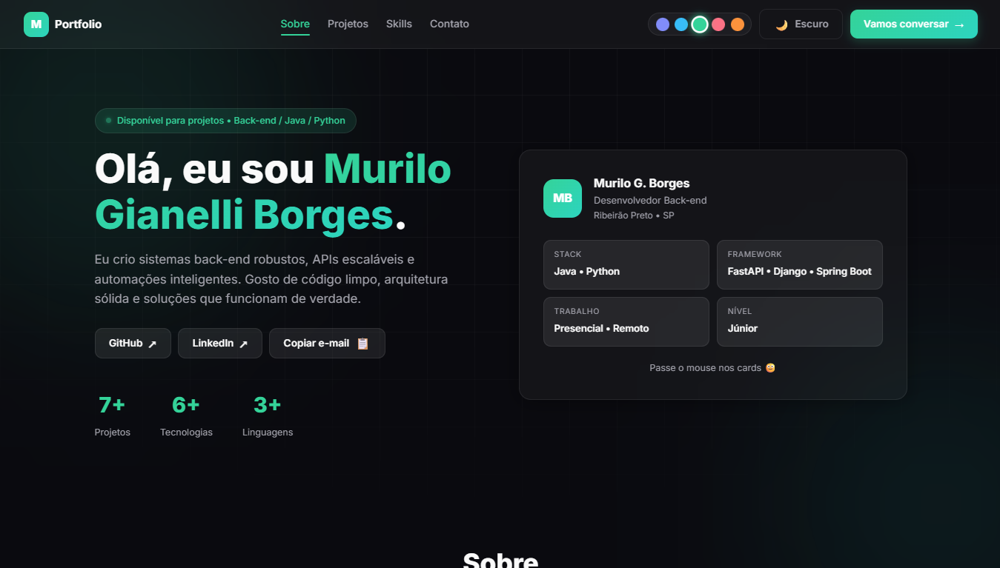

# 🌐 Portfólio — Murilo G. Borges


Meu portfólio pessoal como **Desenvolvedor Back-end Júnior**, construído com HTML, CSS e JavaScript. Um site moderno, responsivo e com tema escuro para apresentar meus projetos, habilidades e formas de contato.

🔗 **Acesse o site:** [gianellimurilo.github.io/Portfolio-Murilo-Gianelli](https://gianellimurilo.github.io/Portfolio-Murilo-Gianelli/)

---

## 📸 Preview

<p align="center">
  
</p>

---

## ✨ Funcionalidades

- ✅ Design moderno com **tema escuro**
- ✅ **Troca de cores** do tema (múltiplas opções de cor de destaque)
- ✅ Alternância entre modo **Escuro / Claro**
- ✅ Layout **100% responsivo** (mobile, tablet e desktop)
- ✅ Seção **Sobre** com apresentação pessoal e card de informações
- ✅ Seção **Projetos** com cards interativos (links para demo e código)
- ✅ Seção **Skills** com tecnologias e ferramentas
- ✅ Seção **Contato** com links para GitHub, LinkedIn e e-mail
- ✅ Animações e transições suaves
- ✅ Deploy automático via GitHub Pages

---

## 👨‍💻 Sobre Mim

| Info | Detalhe |
|---|---|
| **Nome** | Murilo G. Borges |
| **Área** | Desenvolvedor Back-end |
| **Stack** | Java • Python |
| **Frameworks** | FastAPI • Django • Spring Boot |
| **Trabalho** | Presencial • Remoto |
| **Nível** | Júnior |
| **Localização** | Ribeirão Preto, SP |

> 🟢 *Disponível para projetos • Back-end / Java / Python*

---

## ⚙️ Tecnologias do Site

| Tecnologia | Utilização |
|---|---|
| **HTML5** | Estrutura e conteúdo |
| **CSS3** | Estilização, temas e responsividade |
| **JavaScript** | Interatividade, troca de temas e animações |
| **GitHub Pages** | Hospedagem e deploy gratuito |

---

## 📁 Estrutura do Projeto

```
Portfolio-Murilo-Gianelli/
├── index.html       # Página principal
├── styles.css       # Estilos, temas e layout
├── script.js        # Interatividade e troca de temas
├── preview.png      # Screenshot do portfólio
└── README.md        # Documentação
```

---

## 🚀 Como Rodar Localmente

```bash
# 1. Clone o repositório
git clone https://github.com/gianellimurilo/Portfolio-Murilo-Gianelli.git

# 2. Acesse a pasta
cd Portfolio-Murilo-Gianelli

# 3. Abra no navegador
# Basta abrir o arquivo index.html
# Ou use a extensão Live Server no VS Code
```

---

## 🌍 Deploy

O site está hospedado gratuitamente no **GitHub Pages**:

👉 [https://gianellimurilo.github.io/Portfolio-Murilo-Gianelli/](https://gianellimurilo.github.io/Portfolio-Murilo-Gianelli/)

---

## 🛣️ Melhorias Futuras

- [ ] Formulário de contato funcional
- [ ] Adicionar mais projetos ao portfólio
- [ ] SEO e meta tags para redes sociais (Open Graph)
- [ ] Animação de entrada ao rolar a página
- [ ] Versão em inglês

---

## 📝 Licença

Este projeto está sob a licença MIT. Sinta-se à vontade para usar como referência.

---

## 🔗 Contato

<table>
  <tr>
    <td align="center">
      <a href="https://github.com/gianellimurilo">
        <br>
        <sub><b>Murilo G. Borges</b></sub>
      </a><br>
      <sub>Desenvolvedor Back-end • Ribeirão Preto, SP</sub>
    </td>
  </tr>
</table>

[](https://github.com/gianellimurilo)
